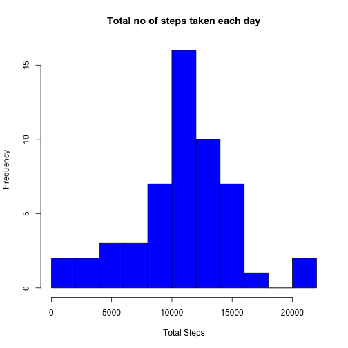
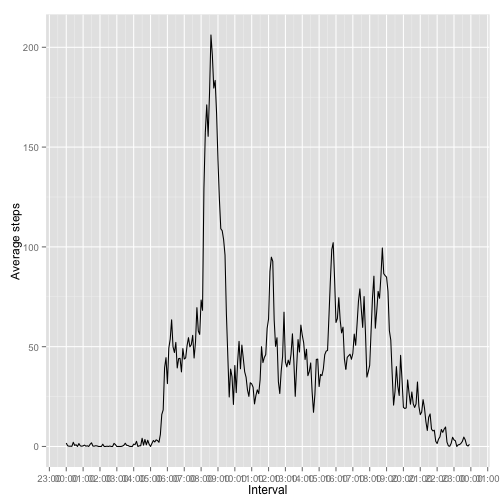
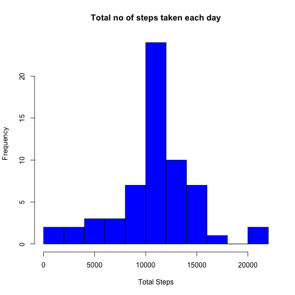

1. Mean total number of steps taken per day

##Total no of steps taken per day


```r
d <- read.csv("activity.csv")
library(dplyr)
filter(d, !is.na(steps)) -> new_d
new_d %>% group_by(date) %>% summarise(steps = sum(steps)) -> new_dsum
head(new_dsum)
```

```
## Source: local data frame [6 x 2]
## 
##         date steps
## 1 2012-10-02   126
## 2 2012-10-03 11352
## 3 2012-10-04 12116
## 4 2012-10-05 13294
## 5 2012-10-06 15420
## 6 2012-10-07 11015
```

##Histogram of the total number of steps taken each day


```r
hist(new_dsum$steps, breaks = "FD", main = "Total no of steps taken each day", xlab = "Total Steps", ylab = "Frequency", col = "Blue")
```

 


##Mean and median of the total number of steps taken per day


```r
d <- read.csv("activity.csv")

library(dplyr)
filter(d, !is.na(steps)) -> new_d
d_mean <- aggregate(new_d$steps, by = list(new_d$date), FUN = mean)
head(d_mean)
```

```
##      Group.1        x
## 1 2012-10-02  0.43750
## 2 2012-10-03 39.41667
## 3 2012-10-04 42.06944
## 4 2012-10-05 46.15972
## 5 2012-10-06 53.54167
## 6 2012-10-07 38.24653
```

```r
d_median <- aggregate(new_d$steps, by = list(new_d$date), FUN = median)
head(d_median)
```

```
##      Group.1 x
## 1 2012-10-02 0
## 2 2012-10-03 0
## 3 2012-10-04 0
## 4 2012-10-05 0
## 5 2012-10-06 0
## 6 2012-10-07 0
```

2. What is the average daily activity pattern?

##Time series plot of the 5-minute interval (x-axis) and the average number of steps taken, averaged across all days (y-axis)


```r
d <- read.csv("activity.csv")
library(dplyr)
filter(d, !is.na(steps)) -> new_d
library(scales)
library(ggplot2)
library(stringr)
d_mean <- aggregate(new_d$steps, by = list(new_d$interval), FUN = mean)
colnames(d_mean) <- c("interval", "mean")
d_mean$interval <- str_pad(d_mean$interval, width = 4, side = "left", pad = "0")
d_mean$interval <- strptime(d_mean$interval, format="%H%M")

ggplot(d_mean, aes(interval, mean, group = 1)) + geom_line() + labs(x = "Interval", y = "Average steps") + scale_x_datetime(labels=date_format("%H:%M"), breaks=date_breaks("1 hour"))
```

 

##5-minute interval containing the maximum number of steps


```r
which.max(d_mean$mean)
```

```
## [1] 104
```
Interval no 104 contains maximum number of steps.

3. Imputing missing values

##Total number of rows with NAs


```r
d <- read.csv("activity.csv")
sum(!complete.cases(d))
```

```
## [1] 2304
```
There are 2304 rows with NAs in the dataset

##Strategy for filling in all of the missing values in the dataset
Calculate the average no of steps for each time interval and substitute that value forNA for the  corresponding time interval.

##A new dataset with the missing data filled in.


```r
d <- read.csv("activity.csv")
library(dplyr)
filter(d, !is.na(steps)) -> new_d
library(stringr)
d_mean <- aggregate(new_d$steps, by = list(new_d$interval), FUN = mean)
colnames(d_mean) <- c("interval", "mean")
d_merged <- merge( d, d_mean, by.x="interval", by.y="interval")
d_merged$steps[is.na(d_merged$steps)] <- d_merged$mean[is.na(d_merged$steps)]
d_merged <- subset(d_merged, select = -mean)
replaced_dataset <- arrange(d_merged, date)
replaced_dataset <- replaced_dataset[,c("steps", "date", "interval") ]
head(replaced_dataset)
```

```
##       steps       date interval
## 1 1.7169811 2012-10-01        0
## 2 0.3396226 2012-10-01        5
## 3 0.1320755 2012-10-01       10
## 4 0.1509434 2012-10-01       15
## 5 0.0754717 2012-10-01       20
## 6 2.0943396 2012-10-01       25
```

##Make a histogram of the total number of steps taken each day and Calculate and report the mean and median total number of steps taken per day.


```r
replaced_dataset %>% group_by(date) %>% summarise(steps = sum(steps)) -> replaced_datasetsum
hist(replaced_datasetsum$steps, breaks = "FD", main = "Total no of steps taken each day", xlab = "Total Steps", ylab = "Frequency", col = "Blue")
```

 

```r
replaced_dataset_mean <- aggregate(replaced_dataset$steps, by = list(replaced_dataset$date), FUN = mean)
head(replaced_dataset_mean)
```

```
##      Group.1        x
## 1 2012-10-01 37.38260
## 2 2012-10-02  0.43750
## 3 2012-10-03 39.41667
## 4 2012-10-04 42.06944
## 5 2012-10-05 46.15972
## 6 2012-10-06 53.54167
```

```r
replaced_dataset_median <- aggregate(replaced_dataset$steps, by = list(replaced_dataset$date), FUN = median)
head(replaced_dataset_median)
```

```
##      Group.1        x
## 1 2012-10-01 34.11321
## 2 2012-10-02  0.00000
## 3 2012-10-03  0.00000
## 4 2012-10-04  0.00000
## 5 2012-10-05  0.00000
## 6 2012-10-06  0.00000
```

4. Differences in activity patterns between weekdays and weekends

##Create a new factor variable in the dataset with two levels – “weekday” and “weekend” 


```r
levels(replaced_dataset$date) <- c(levels(replaced_dataset$date), c("weekday", "weekend"))
replaced_dataset$date <- ifelse(weekdays(as.Date(as.character(replaced_dataset$date)), abbreviate = T) %in% c("Sat", "Sun"), "weekend", "weekday")
```

##A panel plot containing a time series plot of the 5-minute interval (x-axis) and the average number of steps taken, averaged across all weekday days or weekend days (y-axis)

```r
replaced_dataset %>% group_by(date, interval) %>% summarise(steps = mean(steps)) -> replaced_dataset_avg
library(lattice)
xyplot(steps ~ interval|replaced_dataset_avg$date, data = replaced_dataset_avg, type = "l", xlab = "Interval", ylab = "Number of steps", layout=c(1,2))
```

 
